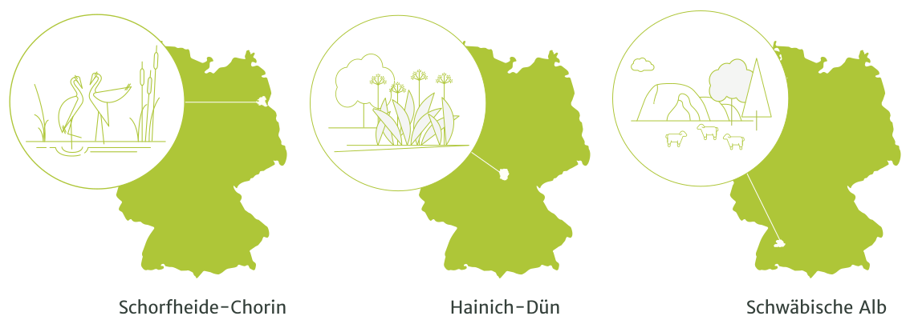
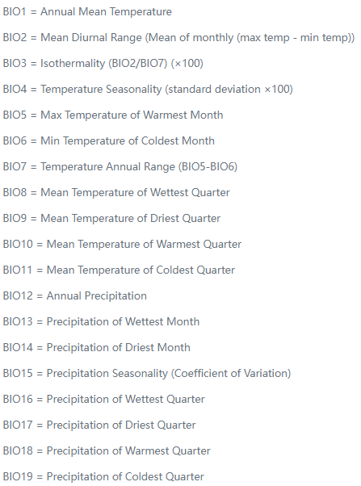
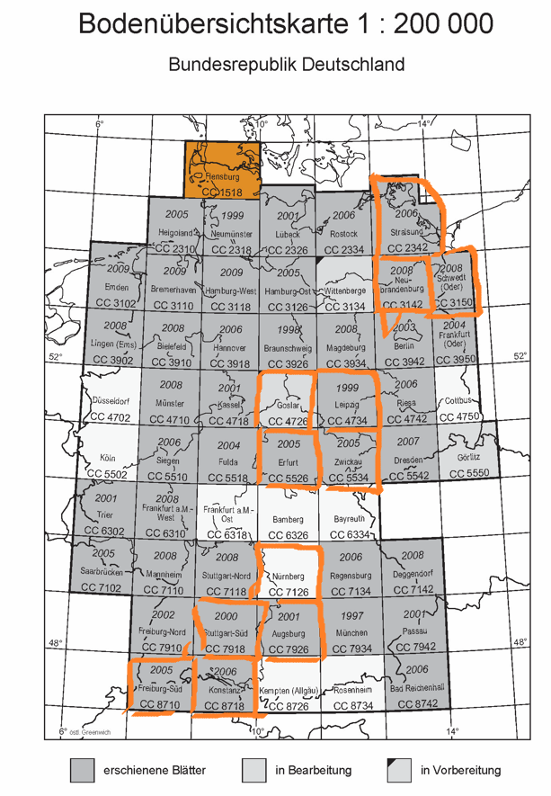

```{r setup, include=FALSE}
knitr::opts_chunk$set(echo = FALSE, message=F, warning = F)
library(here)
library(sf)
library(terra)
library(raster)
library(mapview)
library(kableExtra)
```

# Study sites



```{r, message=F, results='hide',fig.keep='all'}
dp <- "../data/"
sap <- here(dp, "/studyarea")

# explo geometries
geo_exp <- st_read(here(sap, "all3explos.gpkg"))
plots_exp <- st_read(here(sap, "experiementalplots.gpkg"))

# landscapes
lsc_ALB <- st_read(here(sap, "landscape_ALB_UTM.gpkg"))
lsc_HAI <- st_read(here(sap, "landscape_HAI_UTM.gpkg"))
lsc_SEG <- st_read(here(sap, "landscape_SEG_UTM.gpkg"))

```

We assume the landscapes from Naturräume und Großlandschaften Deutschlands https://metadaten.bfn.de/BfNMetaCat23/?lang=de#/datasets/iso/d15f6de3-8711-449a-aa65-678bdc251547 

```{r}
# prep grassland display
gr_ALB <- raster(here(sap, "grassland_ALB_UTM_cat.tif"))
gr_SEG <- raster(here(sap, "grassland_SEG_UTM_cat.tif"))
gr_HAI <- raster(here(sap, "grassland_HAI_UTM_cat.tif"))
```


```{r}

my_pal <- c("#cacbdb", "#139404") # 1 = grasslands
rmaps <- mapview(gr_ALB, na.color="#00000000", col.regions=my_pal)+
  mapview(gr_SEG, na.color="#00000000", col.regions=my_pal)+
  mapview(gr_HAI, na.color="#00000000", col.regions=my_pal)


```


```{r}
# display geometries etc.
geomaps <- mapview(geo_exp, color="#b59018", alpha.regions=0, lwd=2)+
  mapview(lsc_HAI, alpha.regions=0, lwd=2, color="#5467ab")+
  mapview(lsc_ALB, alpha.regions=0, lwd=2, color="#5467ab")+
  mapview(lsc_SEG, alpha.regions=0, lwd=2, color="#5467ab")+
  mapview(plots_exp, col.regions="#edc647", cex=2, color="#edc647")


rmaps+geomaps 
  

```


# Test Dataset

BExis Filters: 
Taxonomic Term: Plants; Project: Botany (core); Forest: No; Above Ground: Yes; Biotic Data Type: Aggregated diversity


Grassland EPs and GPs?

Vegetation Records for Grassland Eps/GPs in 2007, 08, 07-09, 09, 2010, 2011,2012, 2013


Testing [@explo_16826_v4] 
```{r}
d <- read.csv(paste0(dp, "16826_4.csv"))

knitr::kable(head(d)) %>%
  kable_styling(full_width = F, bootstrap_options = c("striped", "hover", "condensed"), font_size = 10) %>%
  row_spec(0, font_size=9) %>%
  column_spec(column=1:47,width_max = "1cm")
  
```

There are 150, i.e. all EPs in the dataset. 
```{r, eval=F}
nrow(d)
any(table(d$EpPlotID)!=1)
```

Merging dataset with geometry 
```{r, eval=F}
# link dataset with geometry 
# d_geo <- merge(plots_exp, d, by.x="ep", by.y="EpPlotID")

# checking why not 150 were merged 
'%notin%' <- Negate('%in%')
misspelledperhaps <- which(d$EpPlotID %notin% plots_exp$ep)
# d$EpPlotID[misspelledperhaps] # leading 0 missed when single digit ID number

# add 0 where ID only contains 4 characters in d
d$EpPlotID[nchar(d$EpPlotID) == 4] <- paste0(substring(d$EpPlotID[nchar(d$EpPlotID) == 4], 1,3), "0", 
                                             substring(d$EpPlotID[nchar(d$EpPlotID) == 4], 4))
# unique(nchar(d$EpPlotID))

# link dataset with geometry 
d_geo <- merge(plots_exp, d, by.x="ep", by.y="EpPlotID")
st_write(d_geo, paste0(dp, "16826_4.gpkg"))
```


```{r}
d_geo <- st_read(paste0(dp, "16826_4.gpkg"))
```


```{r}
pal <-  mapviewPalette("mapviewSpectralColors")
mapview(d_geo["biomass_g"],
        cex="biomass_g",
        legend=TRUE, 
        layer.name="biomass",
        col.regions = pal(150),
        map.types = "Esri.WorldImagery")

mapview(d_geo["shannon"],
        cex="shannon",
        legend=TRUE, 
        layer.name="shannon",
        col.regions = pal(150),
        map.types = "Esri.WorldImagery")

```


# climate and weather
https://www.worldclim.org/data/bioclim.html Bioclim 


```{r, results='hide',fig.keep='all'}
list.dirs(here(dp, "/Basisdaten"), full.names = FALSE)

bioclim_vars <- c("Ann_Mean_Temp", "Mean_Drnl_Rng", "Isotherm", 
                  "Temp_Seas", "Max_T", "Min_T", "T_Ann_Rng", 
                  "Mean_T_Wet", "Mean_T_Dry", "Mean_T_Warm", 
                  "Mean_T_Cold", "Ann_Prec", "Prec_Wet", "Prec_Dry", "Prec_Seas", "Prec_Wet", "Prec_Dry", "Prec_Warm", "Prec_Cold")
```


```{r}
bioclim_ALB_UTM <- rast(here(dp, "/Basisdaten/climate/bioclim_ALB_UTM.tif"))
bioclim_ALB_weather_UTM <- rast(here(dp, "/Basisdaten/weather/bioclim_ALB_weather_UTM.tif"))
```


#### weather 

```{r, results='hide',fig.keep='all'}
bioclim_ALB_weather_UTM <- rast(here(dp, "/Basisdaten/weather/ALB_bioclim-2021_UTM.tif"))
names(bioclim_ALB_weather_UTM) <- bioclim_vars

par(mfrow=c(2,2))
lapply( seq(nlyr(bioclim_ALB_weather_UTM)), function(i) {
  plot(bioclim_ALB_weather_UTM[[i]], main=names(bioclim_ALB_weather_UTM[[i]]))
})
```


# topography 


```{r, results='hide',fig.keep='all'}
top_ALB_UTM <- rast(here(dp, "/Basisdaten/topography/copernicus/ALB_top_UTM.tif"))

par(mfrow=c(2,2))
lapply( seq(nlyr(top_ALB_UTM)), function(i) {
  plot(top_ALB_UTM[[i]], main=names(top_ALB_UTM[[i]]))
})

```

## extent for visualization of basis and reference data 

```{r, results='hide',fig.keep='all'}
# plot(d_geo[d_geo$explrtr == "ALB", "shannon"])
ex_ext_1 <- st_read(paste0(dp, "studyarea/ex_ext.shp"))
ex_ext_2 <- st_read(paste0(dp, "studyarea/ex_ext_2.shp"))

top_ALB_ex <- crop(top_ALB_UTM, ex_ext_1)
top_ALB_ex2 <- crop(top_ALB_UTM, ex_ext_2)

# bioclim variables are only 6 values for this extent, so doesn't really make sense
```


```{r}
mapview(d_geo[d_geo$explrtr == "ALB", "shannon"],
        cex="shannon",
        legend=TRUE, 
        layer.name="shannon",
        col.regions = pal(50),
        map.types = "Esri.WorldImagery")+
  mapview(ex_ext_1,
          layer.name="extent1",
          alpha.regions=0)+
  mapview(as(top_ALB_ex, "Raster"), 
          na.color="#00000000",
          alpha.regions=1,
          map.types = "Esri.WorldImagery")


mapview(d_geo[d_geo$explrtr == "ALB", "shannon"],
        cex="shannon",
        legend=TRUE, 
        layer.name="shannon",
        col.regions = pal(50),
        map.types = "Esri.WorldImagery")+
  mapview(ex_ext_2,
          layer.name="extent2",
          alpha.regions=0)+
  mapview(as(top_ALB_ex2, "Raster"), 
          na.color="#00000000",
          alpha.regions=1,
          map.types = "Esri.WorldImagery")


```


# Soil
Bodenübersichtskarte 1:200.000, i.e. 1 cm = 0.2 km for whole Germany 
https://geoviewer.bgr.de/mapapps/resources/apps/bodenatlas/index.html?lang=de&tab=boedenDeutschlands

https://produktcenter.bgr.de/terraCatalog/DetailResult.do?fileIdentifier=154997F4-3C14-4A53-B217-8A7C7509E05F



### To do
* Question @Meeting: ALB Explo Geometry > landscape unit 


### Research Design
https://www.biodiversity-exploratories.de/en/about-us/research-design/

### Better dataset
IDs 31434 and 31435 


## References
